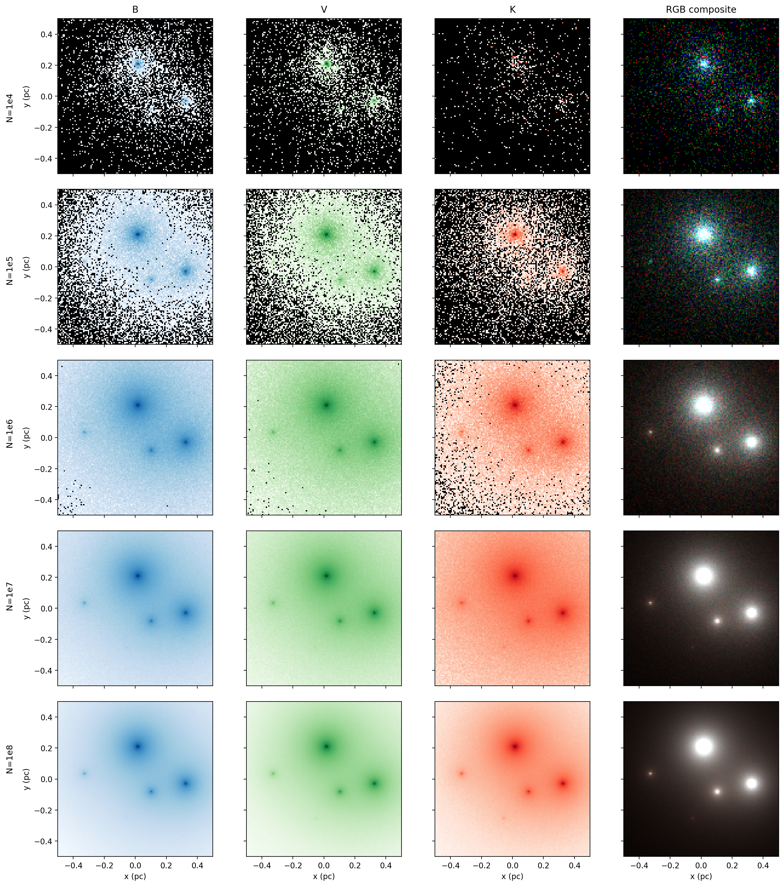
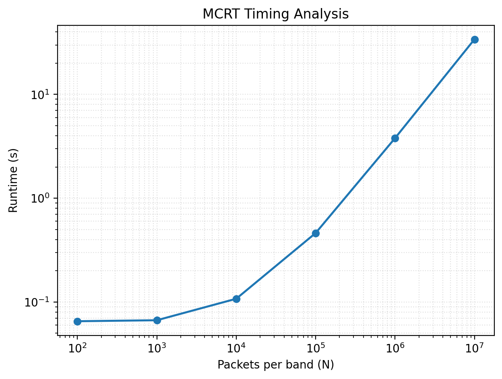

# Research Memo
## Executive Summary

This project models how starlight interacts with dust in a molecular cloud using a Monte Carlo Radiative Transfer (MCRT) simulation. Five ZAMS stars were placed in a one-parsec cubic grid, and photon packets were emitted and propagated through a dusty medium using discrete absorption. Band-averaged opacities for B, V, and K filters were calculated from the Draine (2003) dust model.

The simulation was fully validated. For each run, the energy was conserved to < 0.1% and the convergence followed the expected $N^(-1/2)$ trend. After implementing Numba jit software to speed up and run each photon packet in parallel, the simulation computed $10^7$ packets in less than a minute. 

This simulation successfully shows how reddening occurs from wavelength-dependent dust extinction. The higher the wavelength, the lower the escape fraction, for B, V, and K bands at least. 

## Methodology
### Approach

I generally structured this project on the provided source code. There is a star module, which calculates and stores information about a ZAMS star. I added a function that assigns the star's ID as its spectral type, based on its temperature, but never actually used it within the simulation or analysis. There is also a dust module, which contains functions to read and calculate values from the Draine file. The grid module contains a grid class, which stores and calculates values for a grid. The grid is set up so that it is a 3D cube of length L with a number of equal cubical cells inside. The center of the box has the position (0,0,0), but the indices of the cells start in the bottom left corner. 

The transport module contains all of the functions for running the MCRT simulation. Each packet is propagated in parallel, but each band is run separately. This is because when scaling up, the bands will have a finite number (different process for spectroscopy), while the photons could increase exponentially, which is what I tested here. 

The detectors, mcrt_viz, testing, and project3_analysis modules are all for data handling after running mcrt. They set it up, run mcrt, save results, run tests, display results, and print progress and validation lines. 

### Algorithms

For each band, each star contributes some luminosity. From a luminosity-dependent CDF, a star will be chosen to emit a photon with a luminosity of:

$$L_{\text{packet}} = \frac{\sum _i L_{i,{\text{band}} }{ N_{\text{packets}}} $$.

For each star with temperature T and band limits $\lambda_1, \lambda_2$, the Planck-mean opacity can be calculated as:

$$\langle\kappa\rangle_{\text{band,star}} = \frac{\int_{\lambda_1}^{\lambda_2} \kappa(\lambda) B_\lambda(T_{\text{eff,star}}) d\lambda}{\int_{\lambda_1}^{\lambda_2} B_\lambda(T_{\text{eff,star}}) d\lambda}$$.

The optical depth $\tau$ that each packet must move through before being absorbed is determined by sampling a random number $\epsilon$ from (0,1) and computing:

$$\tau_{\text{sample}} = - \ln (\epsilon)$$.

At each step of distance s along its path of travel, a packet will accumulate an optical depth of: 

$$\tau_{\text{accumulated}} = \tau_{\text{accumulated}} + \kappa _b \rho{\text{dust}} \Delta s$$

until $\tau_{\text{accumulated}} = \tau_{\text{sample}}$, at which point, the packet will absorb. If the packet escapes the grid before that point, the packet is recorded as escaped. 

## Analysis
### Physical Results

Figure 1 shows the Draine (2003) dust-opacity curve with shaded B, V, and K bands at calculated Planck-mean opacities.

This validates the dust-opacity input used in the simulation. The curve shows the steep decline in opacity from ultraviolet to infrared wavelengths. The calculated band-averaged points lie precisely where expected $(K > V > B)$, confirming that the Draine table and Planck weighting were implemented correctly. 

| Quantity | B-band | V-band | K-band |
|----------|--------|--------|--------|
| Band-averaged opacity $\kappa$ (cm$^2$/g) | 9969.45| 7391.20| 1589.27|
| Input luminosity ($L_\odot$) | 2932.72| 1244.75| 31.58|
| Escaped luminosity ($L_\odot$) | 1588.38| 785.58| 28.52|
| Escape fraction | 0.5416| 0.6311| 0.9031|
| Mean optical depth | 0.6132| 0.4603| 0.1019|

Table 1 shows the main MCRT quantities for the B, V, and K bands, including Planck-mean dust opacity, total input and escaped luminosities, escape fractions, and mean optical depths.

The input luminosities represent the total stellar energy emitted within each band, while the escaped luminosities are the portion that leaves the dusty domain. Their ratio gives the escape fraction, which represents the effectiveness of dust absorption at that wavelength. As predicted, the escape fractions follow $(K > V > B)$ as well.

Figure 2 compares the intrinsic and escaped spectral energy distributions of the five-star cluster, shown as normalized $\lambda L_{\lambda}$ proxies for the B, V, and K bands.

This demonstrates how dust extinction reddens the emergent spectrum. The intrinsic emission, dominated by hot O and B-type stars, peaks in the blue, but after passing through the dusty medium, the escaped curve tilts toward the infrared. B-band luminosity is suppressed the most because dust grains absorb efficiently at short wavelengths, while K-band light, with its much longer wavelength, escapes almost unaffected. The relative heights of the points illustrate the wavelength-dependent escape fractions, $(K > V > B)$, which indicate interstellar reddening. 

Figure 3 shows two-dimensional projections of absorbed luminosity for each band, combined into an RGB composite (R = K, G = V, B = B) for multiple packet runs.

The absorption maps showcase where most of the radiation is deposited within the dust cloud. Each star has a high-absorption area surrounding it, where all of those absorbed photons would deposit energy and heat. Blue regions correspond to strong B-band absorption near massive, hotter stars, while redder areas indicate K-band dominance from less massive, cooler stars. The gradual transition from blue to red across the grid highlights how dust absorbs shorter wavelengths more effectively, while longer wavelengths can travel further through the cloud.

### Numerical Analysis

Figure 4 shows the escape fraction versus packet number for B, V, and K bands, plotted on a log–log scale.

This verifies the statistical stability of the mcrt solution. Each band’s escape fraction remains nearly constant with increasing packet count, confirming that the simulation converges to a consistent mean value. There does not appear to be any significant noise, since the data sets are all substantially large. The horizontal lines show the escape fractions for each wavelength, reinforcing $(K > V > B)$. 

Figure 5 shows absolute error as a function of number of packets, with overplotted $N^(-1/2)$ reference lines. 

The convergence-error plot displays how simulation noise decreases with sample size. The slope of each band’s curve closely follows the dashed $N^(-1/2)$ line, confirming the theoretical expectation for Monte Carlo convergence. The flattening with larger N values indicates that statistical noise eventually becomes dominated by other sources of error, like floating-point precision, parallel-memory overhead, or grid resolution. 

Figure 6 shows the time complexity of this JIT-parallelized MCRT simulation over a range of packet numbers. 

The time complexity of the MCRT is O(N); however, since it is run in parallel, that O(N) is divided among however many computations can be done at once, instead of multiplying it by the number of steps. To speed it up even more, I used jit for every sub-function that goes into the MCRT instead of calculating and pulling information from classes, which is significantly slower. These speed-ups multiplied by N packets make a huge difference in terms of performance time. While both methods may be O(N), this simulation is not going to be running infinite photons, so proving a significant speed-up to N=$10^7$ is successful. 

## Validation

The code was verified against numerout tests before full analysis. In an empty box, all packets escaped as expected, while in an opaque box none did, confirming the correct handling of optical depth and boundary conditions. 

A single central star in a uniform medium reproduced the analytical solution, $f_{\text{esc}} = \esp{-\tau}$, within $3\sigma$ uncertainty, validating the absorption algorithm and grid stepping. 

Energy conservation tests showed that the total input luminosity was less than 0.1% from the sum of absorbed and escaped luminosities, proving that energy was conserved through the simulation. 

Together, these results confirm that the model is both physically accurate and numerically stable.

## Extensions

For this project, my extension was the optimize performance with Numba's jit compiler, or more specifically, njit. Njit compiles Python functions into machine code so NumPy operations and loops run without interpreter overhead, giving near-C performance. I also used fastmath=True, which lets Numba reorder and approximate certain floating-point operations to vectorize math instructions faster.

For parallelization, I used prange, which splits the loop across all CPU threads, running maybe 8-16 packet propagations at a time. This, in conjunction with njit and fastmath, made the MCRT engine work significantly faster. 

## Conclusions

This project successfully developed and validated a Monte Carlo Radiative Transfer model that accurately simulates how dust alters the observed light from embedded star clusters. The results confirmed all physical expectations: energy was conserved, escape fractions followed the expected $(K > V > B)$,  and the spectral energy distribution showed reddening due to wavelength-dependent opacity. The combination of Numba’s njit, fastmath, and prange provided major speed improvements, allowing millions of photon packets to be simulated efficiently, without sacrificing accuracy. Overall, the code achieves both physical accuracy and computational scalability, forming a solid base for future extensions such as scattering or non-uniform dust distributions.

## References

I referenced the course website quite a bit; it was helpful. I also relied heavily on Numba’s documentation and tutorials for njit, fastmath, and prange, for my extension. 

For the band opacities, I used the Draine (2003) dust-opacity file, kext_albedo_WD_MW_5.5A_30.txt. And for the stellar temperature and spectral-type matching, I used the Pecaut & Mamajek (2013) file, EEM_dwarf_UBVIJHK_colors_Teff.txt. 

